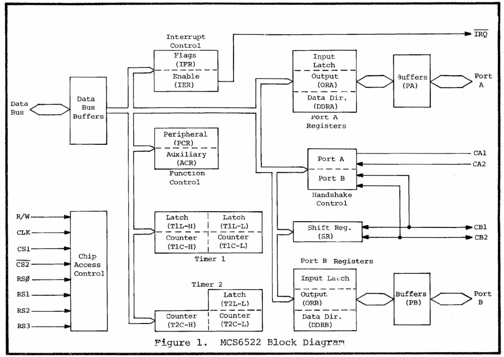
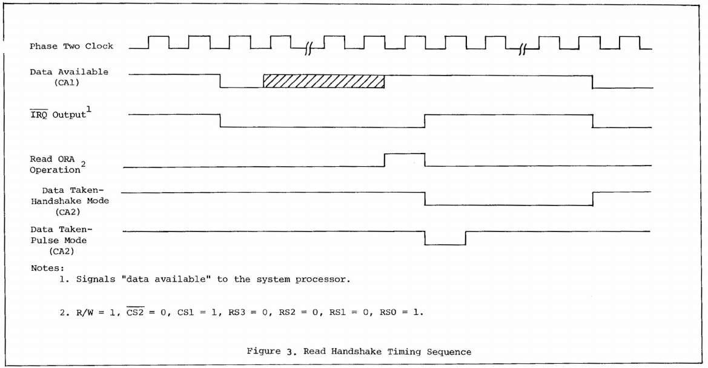
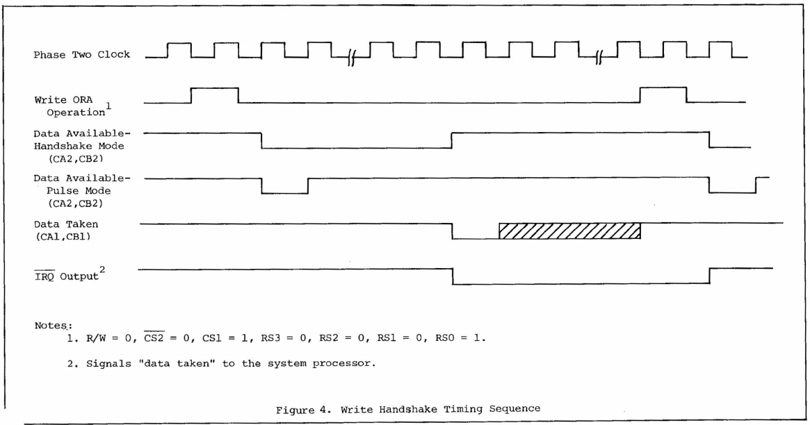

# VIA6522 抜粋

## プロセッサインターフェース

このセクションには、MCS6522をシステムプロセッサに接続するために使用されるバスと制御ラインの説明が含まれています。このインターフェイスに関連付けられているACおよびDCパラメータは、このドキュメントの21〜24ページで指定されています。

### フェーズ2クロック（φ2）

  MCS6522とシステムプロセッサ間のデータ転送は、フェーズ2クロックが1の間のみ行われます。さらに、φ2はチップ上のさまざまなタイマー、シフトレジスタなどのタイムベースとして機能します。

### チップセレクトライン（CS1、~CS2）

  通常、2つのチップセレクト入力は、直接またはデコードを介してプロセッサアドレスラインに接続されます。選択したMCS6522レジスタは、CS1が1でCS2が0のときにアクセスされます。

### ライン選択レジスタ（RSO、RSI、RS2、RS3）
  
  4つのレジスタ選択ラインは通常、プロセッサのアドレスバスラインに接続され、プロセッサがアクセスされる内部MCS6522レジスタを選択できるようにします。 16の可能な組み合わせは、次のようにレジスタにアクセスします。

| RS*  | レジスタ | RS*  | レジスタ    | RS*  | レジスタ    | RS*  | レジスタ |
|------|----------|------|-------------|------|-------------|------|----------|
| 0000 | ORB      | 0100 | T1L-L/T1C-L | 1000 | T2L-L/T2C-L | 1100 | PCR      |
| 0001 | ORA(H)   | 0101 | T1C-H       | 1001 | T2C-H       | 1011 | IFR      |
| 0010 | DDRB     | 0110 | T1L-L       | 1010 | SR          | 1011 | IER      |
| 0011 | DDRA     | 0110 | T1L-H       | 1011 | ACR         | 1011 | ORA(NH)  |

### ラインの読み取り/書き込み（R/W）
MCS6522とシステムプロセッサ間のデータ転送の方向は、R/Wラインによって制御されます。 R/Wが0の場合、データはプロセッサから選択したMCS6522レジスタに転送されます（書き込み操作）。 R/Wが1で、チップが選択されている場合、データはMCS6522から転送されます（読み取り操作）。

### データバス（DBO-DB7）
8本の双方向データバスラインは、MCS6522とシステムプロセッサ間でデータを転送するために使用されます。内部ドライバは、チップが選択され（CS1=1、CS2=0）、R/Wが1(R)、φ2クロックが1の場合を除き、高インピーダンス状態のままになります。このとき、選択したレジスタの内容がデータバスに配置されます。チップが選択され、R/Wが0、φ2 = 1の場合、データバス上のデータは選択されたMCS6522レジスタに転送されます。

### リセット（RES）

リセット入力は、すべての内部レジスタを論理0にクリアします（T1、T2、およびSRを除く）。これにより、すべての周辺インターフェイスラインが入力状態になり、タイマー、シフトレジスタなどが無効になり、チップからの割り込みが無効になります。

### 割り込み要求（IRQ）

割り込み要求出力は、内部割り込みフラグが設定され、対応する割り込みイネーブルビットがロジック1の場合は常に0になります。この出力は、割り込み要求信号をシステム内の他の同等の信号と「ワイヤードOR」できる「オープンドレイン」です。。

## 周辺インターフェース

このセクションには、内部MCS6522レジスタの制御下で周辺機器を駆動するために使用されるバスと制御ラインの簡単な説明が含まれています。

### 周辺Aポート（PAO-PA7）

周辺Aポートは、データ方向レジスタの制御下で入力または出力として機能するように個別にプログラムできる8本のラインで構成されています。出力ピンの極性は出力レジスタによって制御され、入力データはCA1ラインの制御下で内部レジスタにラッチできます。これらの動作モードはすべて、内部制御レジスタを介してシステムプロセッサによって制御されます。これらの線は、入力モードで1つの標準TTL負荷を表し、出力モードで1つの標準TTL負荷を駆動します。

### 周辺A制御線（CA1、CA2）

2本の周辺A制御線は、割り込み入力またはハンドシェイク出力として機能します。各ラインは、対応する割り込みイネーブルビットで内部割り込みフラグを制御します。さらに、CA1は、ペリフェラルAポート入力ライン上のデータのラッチを制御します。 さまざまな動作モードは、内部制御レジスタを介してシステムプロセッサによって制御されます。 CA1は高インピーダンス入力のみであり、CA2は入力モードで1つの標準TTL負荷を表します。 CA2は、出力モードで1つの標準TTL負荷を駆動します。

### 周辺Bポート（PBO-PB7）

周辺Bポートは、PAポートとほぼ同じ方法で出力レジスタとデータ方向レジスタによって制御される8本の双方向回線で構成されます。さらに、PB7出力信号の極性は、インターバルタイマーの1つによって制御でき、2番目のタイマーはPB6ピンのパルスをカウントするようにプログラムできます。これらの線は、入力モードで1つの標準TTL負荷を表し、出力モードで1つの標準TTL負荷を駆動します。さらに、出力モードで1.5 VDCで30 mAを供給して、出力がダーリントントランジスタスイッチを直接駆動できるようにします。

### 周辺B制御線（CB1、CB2）

周辺B制御線は、割り込み入力またはハンドシェイク出力として機能します。 CA1およびCA2と同様に、各ラインは対応する割り込みイネーブルビットで割り込みフラグを制御します。 さらに、これらのラインは、シフトレジスタの制御下でシリアルポートとして機能します。 これらの線は、入力モードで1つの標準TTL負荷を表し、出力モードで1つの標準TTL負荷を駆動します。 さらに、出力モードで1.5 VDCで1.0 mAを供給して、出力がダーリントントランジスタスイッチを直接駆動できるようにします。

## MCS6522の動作

このセクションでは、図1に示すロジックのさまざまなブロックについて説明します。さらに、MCS6522の内部動作について詳しく説明します。

### ポートAレジスタ、ポートBレジスタ

8ビットの各周辺ポートへのアクセスには、3つのレジスタが使用されます。各ポートには、周辺ピンが入力または出力のどちらとして機能するかを指定するためのデータ方向レジスタ（DDRA、DDRB）があります。データ方向レジスタのビットの0は、対応する周辺機器ピンを入力として機能させます。 1の場合、ピンは出力として機能します。

各周辺ピンは、出力レジスタ（ORA、ORB）および入力レジスタ（IRA、IRB）のビットによっても制御されます。ピンが出力として機能するようにプログラムされている場合、ピンの電圧は出力レジスタの対応するビットによって制御されます。出力レジスタの1はピンをHighにし、0はピンをLowにします。データは、入力として機能するようにプログラムされたピンに対応する出力レジスタビットに書き込むことができます。ただし、ピンは影響を受けません。

周辺ポートを読み取ると、入力レジスタ（IRA、IRB）の内容がデータバスに転送されます。入力ラッチを無効にすると、IRAは常にPAピンのデータを反映します。入力ラッチを有効にすると、IRAはCA1のアクティブな遷移によってCA1割り込みフラグ（IFR1）を設定する前のポートAの内容を反映します。

IRBレジスタも同様の方法で動作します。ただし、出力ピンの場合、対応するIRBビットは実際のピンではなく、出力レジスタビットの内容を反映します。これにより、出力ピンが最大電圧にならない場合に、適切なデータをプロセッサに読み込むことができます。ポートBで入力ラッチが有効になっている場合、CB1割り込みフラグを設定すると、割り込みフラグがクリアされるまで、IRBは入力データとORBデータのこの組み合わせをラッチします。

### ハンドシェイク制御

MCS6522では、「ハンドシェイク」ラインの操作により、システムプロセッサと周辺機器間のデータ転送を非常に確実に制御できます。ポートA回線（CA1、CA2）は読み取り操作と書き込み操作の両方でデータをハンドシェイクし、ポートB回線（CB1、CB2）は書き込み操作でのみハンドシェイクします。

#### 読み出しハンドシェイク

周辺機器からシステムプロセッサへのデータ転送の積極的な制御は、「読み取り」ハンドシェイクを使用して非常に効果的に実現できます。この場合、周辺機器は有効なデータが周辺機器ポートに存在することをプロセッサに知らせるために「データ準備完了」を生成する必要があります。この信号は通常、プロセッサを中断し、プロセッサがデータを読み取り、「データ取得」信号を生成します。周辺機器は、新しいデータを利用可能にすることで応答します。このプロセスは、データ転送が完了するまで続きます。

MCS6522では、ペリフェラルAポートでのみ自動「読み取り」ハンドシェイクが可能です。 CA1割り込み入力ピンは「データ準備完了」信号を受け入れ、CA2は「データ取得」信号を生成します。 Data Ready信号は、プロセッサを中断したり、ソフトウェアの制御下でポーリングできる内部フラグを設定します。 Data Taken信号は、システムプロセッサによってLowに設定され、Data Ready信号によってクリアされるパルスまたはDCレベルのいずれかです。これらのオプションは、通常の読み取りハンドシェイクシーケンスを示す図3に示されています。

#### 書き込みハンドシェイク

システムプロセッサから周辺機器へのハンドシェイクデータを許可する操作のシーケンスは、読み取りハンドシェイクのセクションAで説明したものと非常に似ています。 ただし、「書き込み」ハンドシェイクの場合、プロセッサは（MCS6522を介して）「データ準備完了」信号を生成する必要があり、周辺機器は「データ取得」信号で応答する必要があります。 これは、MCS6522のPAポートとPBポートの両方で実現できます。 CA2またはCB2は、DCレベルまたはパルスモードのいずれかでデータ準備出力として機能し、CA1またはCB1は周辺デバイスからの「データ取得」信号を受け入れ、割り込みフラグを設定し、「データ準備」出力をクリアします。 このシーケンスを図4に示します。

### タイマー1

#### 前書き

インターバルタイマーT1は、2つの8ビットラッチと1つの16ビットカウンターで構成されています。 ラッチは、カウンタにロードされるデータを保存するために使用されます。 ロード後、カウンターはシステムクロックレートで、つまりフェーズ2入力ピンに適用されるクロックの制御下で減少します。 ゼロに達すると、割り込みフラグが設定され、IRQが低くなります。 その後、タイマーはそれ以上の割り込みを無効にするか、ラッチの内容を自動的にカウンターに転送し、デクリメントを続けます。 さらに、タイマーは、「タイムアウト」するたびに周辺ピンの出力信号を反転するように指示できます。 これらのモードのそれぞれについて、以下で個別に説明します。

#### タイマー1レジスタの書き込み
4つのT1アドレスのそれぞれに書き込むときに行われる操作は次のとおりです。

| RS   | 操作(R/W=0)                                                                                                              |
|------|--------------------------------------------------------------------------------------------------------------------------|
| 0100 | ラッチ低位への書き込み                                                                                                   |
| 0101 | ラッチ高位への書き込み。 カウンタ高位への書き込み。 低ラッチの低位カウンタへの転送。 T1割り込みフラグのリセット |
| 0110 | ラッチ低位への書き込み                                                                                                   |
| 0111 | ラッチ高位への書き込み。  T1割り込みフラグのリセット                                                                  |

プロセッサは、低次カウンタ（T1C-L）に直接書き込みをしないことに注意してください。 代わりに、この半分のカウンタは、プロセッサが上位のカウンタに書き込むときに、下位のラッチから自動的にロードされます。 実際、タイミング操作は高次カウンターへの書き込みによってトリガーされるため、一部のアプリケーションでは低次カウンターに書き込む必要はない場合があります。

2番目のアドレスセットにより、プロセッサは進行中のカウントダウンに影響を与えることなくラッチレジスタに書き込むことができます。これについては、以下で詳しく説明します。

#### タイマー1レジスタの読み取り

タイマー1レジスタを読み取る場合、4つのアドレスは次のように4つのレジスタに直接関連付けられます。

| RS   | 操作(R/W=1)                                              |
|------|----------------------------------------------------------|
| 0100 | T1低位カウンタの読み取り。 T1割り込みフラグのリセット |
| 0101 | T1高位カウンタの読み取り。                               |
| 0110 | T1低位ラッチの読み取り。                                 |
| 0111 | T1高位ラッチの読み取り。                                 |

#### タイマー1の動作モード

T1動作モードを選択できるように、補助制御レジスタには2ビットが用意されています。 これらのビットと4つの可能なモードは次のとおりです。

| ACR7 出力 | ACR6 フリーラン       | モード                                                                     |
|------|------------|----------------------------------------------------------------------------|
| 0    | 0          | T1がロードされた時に1回のタイムアウト割り込みを生成する。PB7は無効である。 |
| 0    | 1          | 連続した割り込みを生成する。PB7は無効である。                              |
| 1    | 0          | T1がロードされた時に1回の割り込みを生成し、PB7にパルスを出力する。         |
| 1    | 1          | 連続した割り込みとPB7への矩形波を生成する。 |

